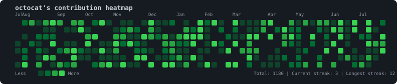

# ASCII Contribution Heatmap 

A GitHub contribution heatmap rendered in retro terminal block characters (`░ ▒ ▓ █`), auto-generated daily via GitHub Actions, and auto-injected into your README — no copy-pasting, no manual updates.

Ships as **both** a raw ASCII text block *and* an SVG image, so it looks good whether you want the terminal aesthetic in a code fence or a crisp image embed.

<p align="center">
  
</p>

<details>
<summary>ASCII version (click to expand)</summary>

```
    Jul         Sep     Oct     Nov       Dec     Jan     Feb     Mar       Apr     May       Jun     Jul     
Mon   ▒ ▓ ░ ▓ █ ▓   ▓ ▓   ▒ █ ░   ░ ░   ░ █ ░ ░ ▒   ░   █ ▒ █ ░   █ ░ ░ ░ ▓ █     ▓ ░ ▓ ░ ▓ ▓ ░ █ ░ █   █   ▒ 
            ░ ░   ░ ░ █ ░       ░ ▒ ▓ ▒   ▓ ░       ▓ ▒ █ ░   ▒   ▒   ░ ░ ▓   ▒ █ ▒ ▒     ▒ ░ █ ▓ ░ █   █ ░   
Wed   ░   ▒ ▒ ▒         ▓ █     ▓ ▓ ░ ░ █ ▓ ▒ ▓ ░ ▓ █ █ █ ░     ▒ ░ ░ █ █   █   ▓ █ ▒   █   ▒   █ ░   ▒ ▒   █ 
    ░   ▒ ░   █   ░ ░   █   ░ ░ █ ▒ █ ▒ ░     ▓ ▓ ▒ ▒ █   ░ █ ▒   █   ▓         ▓ ▒ ░   ▒   ░ █   ░     █ ▓ ▓ 
Fri ░ ▒   ▒ ░   ▒ ▓ █ ▒ ░ ░ █ ░ ▓     ▒ ▒ ░   ▒ ▓ ░ ░   ░ ░   ░ █   ▓ ▓ ▓     ░     ░ ▒     █   █   ░   ░ ░ █ 
      ▒   ░ █ ▓     █ ░ ░   ░ ░ ░ ░   █ █   ░ ░ ▒ ▓ ░ █ ░             █ ░   ░ ░ ▒   ▒     ▒     ░ ▓ ░ ░ ▓ ░   
    ░ █   ▓   ░ ▓ ▒ ▓     ▒ ▓ █ ░ █ ░ ░   █   █ █ ░ ▓   ░ █ ░   █ █   ▒   ░ ░ ░   ▒ ▒ ▓   ▓   ▓     ▒ ▓ ░     

Less   ░ ▒ ▓ █ More
```

</details>

---

## Quick start (3 steps)

### 1. Get the tool into your repo

Fork/template this repo, **or** copy these three things into your existing profile-README repo:
- `scripts/generate_heatmap.py`
- `.github/workflows/update-heatmap.yml`
- `requirements.txt` and `config.yml`

### 2. Set your username and a token

In your repo, go to **Settings → Secrets and variables → Actions**:

| Type | Name | Value |
|---|---|---|
| Variable | `HEATMAP_USERNAME` | your GitHub username |
| Secret | `HEATMAP_TOKEN` | a [personal access token](https://github.com/settings/tokens) with `read:user` scope |

> The default `GITHUB_TOKEN` that Actions provides automatically **cannot** read contribution data — you need a personal access token (classic or fine-grained with "read-only" access to your profile) stored as a secret named `HEATMAP_TOKEN`.

### 3. Add the marker to your README

Open the README you want the heatmap to appear in, and paste this anywhere:

```markdown
<!-- HEATMAP:START -->
<!-- HEATMAP:END -->
```

That's it. On the next scheduled run (or trigger it manually via **Actions → Update Contribution Heatmap → Run workflow**), the workflow will:

1. Fetch your last 12 months of contributions
2. Render the ASCII grid + SVG
3. Replace everything between the two markers with the fresh output
4. Commit and push automatically

---

## Customization

Edit `config.yml`:

```yaml
theme: green       # green | ocean | sunset | mono
output_dir: assets  # where heatmap.svg / heatmap.txt are written
readme_path: README.md
```

### Themes

| `green` (default) | `ocean` | `sunset` | `mono` |
|---|---|---|---|
| GitHub-classic | Blues | Warm orange/red | Grayscale |

### Changing the schedule

Edit the cron expression in `.github/workflows/update-heatmap.yml`:

```yaml
on:
  schedule:
    - cron: "17 3 * * *"   # daily at 03:17 UTC
```

Use [crontab.guru](https://crontab.guru) to build a different schedule.

---

## How it works

- `scripts/generate_heatmap.py` queries the [GitHub GraphQL API](https://docs.github.com/en/graphql) for your `contributionCalendar`.
- Daily counts are bucketed into 5 intensity levels (0–4) using quartiles of your own activity, so the heatmap scales to *your* habits rather than a fixed global scale.
- The ASCII grid uses `" ░ ▒ ▓ █"` for levels 0–4, laid out in the same week-column format GitHub uses.
- The SVG is generated as plain markup (no external rendering dependencies) with per-cell `<title>` tooltips showing exact date/count, plus a built-in stats footer (year, total contributions, active days, best week, and both streaks with date ranges). The username/title itself isn't drawn inside the SVG — it's already shown by the `### {username}'s Contribution Heatmap` heading placed above it in your README, so it's not duplicated.
- The script looks for `<!-- HEATMAP:START -->` / `<!-- HEATMAP:END -->` in your target README and replaces everything between them — if the markers aren't found, it appends the block to the end of the file instead.

---

## Running locally

```bash
pip install -r requirements.txt
export GH_TOKEN=ghp_your_token_here
export GH_USERNAME=your-username
python scripts/generate_heatmap.py
```

This writes `assets/heatmap.svg` and `assets/heatmap.txt`, and updates `README.md` in place.

---

## License

MIT — use it, fork it, ship it in your own profile.
